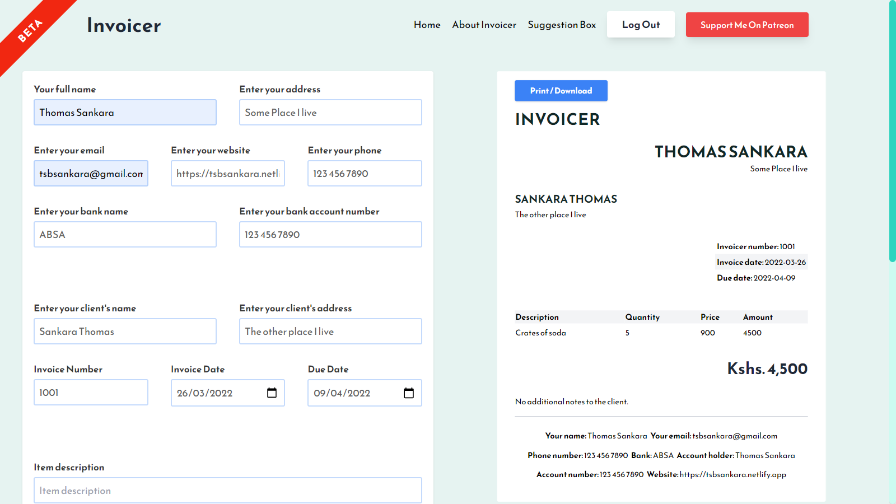

# Invoice Hub

A responsive **React-based invoice generator** that allows users to create, edit, preview, print, and save professional invoices directly from the browser.

<p align="center">
  
</p>

## Overview

Invoice Hub is a frontend web application designed to simplify the process of creating invoices.

Users can enter client information, invoice details, products or services, quantity, price, and additional notes. The application automatically calculates item amounts and the final invoice total while updating the invoice preview in real time.

## Features

* Add client name and address
* Enter invoice number, invoice date, and due date
* Add multiple products or services
* Automatically calculate item amount using quantity and price
* Automatically calculate the total invoice value
* Edit existing invoice items
* Delete invoice items with confirmation
* Add additional notes or payment instructions
* Real-time invoice preview
* Print invoices directly from the browser
* Save invoices as PDF using the browser print option
* Responsive design for different screen sizes
* Form validation with notification messages
* Basic authentication support using Netlify Identity

## Tech Stack

**Frontend**

* React.js
* JavaScript
* HTML5
* Tailwind CSS

**React Features**

* React Hooks
* React Context API
* React Router

**Libraries**

* React To Print
* React Toastify
* Formik
* UUID
* React Icons
* Collect.js
* Netlify Identity

## How It Works

The application uses the **React Context API** to manage invoice data across different components.

When a user adds an invoice item, the application stores:

```text
Description
Quantity
Price
Amount
```

The amount is calculated automatically:

```text
Amount = Quantity × Price
```

The final invoice amount is calculated by adding all item amounts:

```text
Total = Sum of all invoice item amounts
```

Whenever the user updates the form, the invoice preview is updated instantly without refreshing the page.

## Invoice Management

Users can add multiple items to an invoice and manage them using edit and delete options.

Each invoice item receives a unique ID using the **UUID library**, which helps identify individual records when editing or deleting them.

## Print and PDF

The project uses **React To Print** to generate a printable version of the invoice.

Users can click the **Print / Download** button and then:

* Print the invoice
* Save the invoice as PDF
* Select printer and page settings

## Installation

Clone the repository:

```bash
git clone https://github.com/prasun-105/invoice-hub.git
```

Move into the project directory:

```bash
cd invoice-hub
```

Install dependencies:

```bash
npm install
```

Start the development server:

```bash
npm start
```

The application will normally run at:

```text
http://localhost:3000
```

## Future Improvements

Some improvements that can be added in future versions:

* Backend and database integration
* Permanent invoice storage
* User-specific invoice history
* Direct PDF download
* Send invoices through email
* GST, tax, and discount calculations
* Multiple currency support
* Multiple invoice templates
* Business logo upload
* Customer management
* Invoice search and filtering

## Project Purpose

This project demonstrates practical implementation of:

* React component-based architecture
* React Hooks
* Context API state management
* Form handling
* CRUD-style operations
* Real-time calculations
* Conditional rendering
* Client-side routing
* Responsive UI design
* Invoice printing functionality

## Repository

**GitHub:** `prasun-105/invoice-hub`
